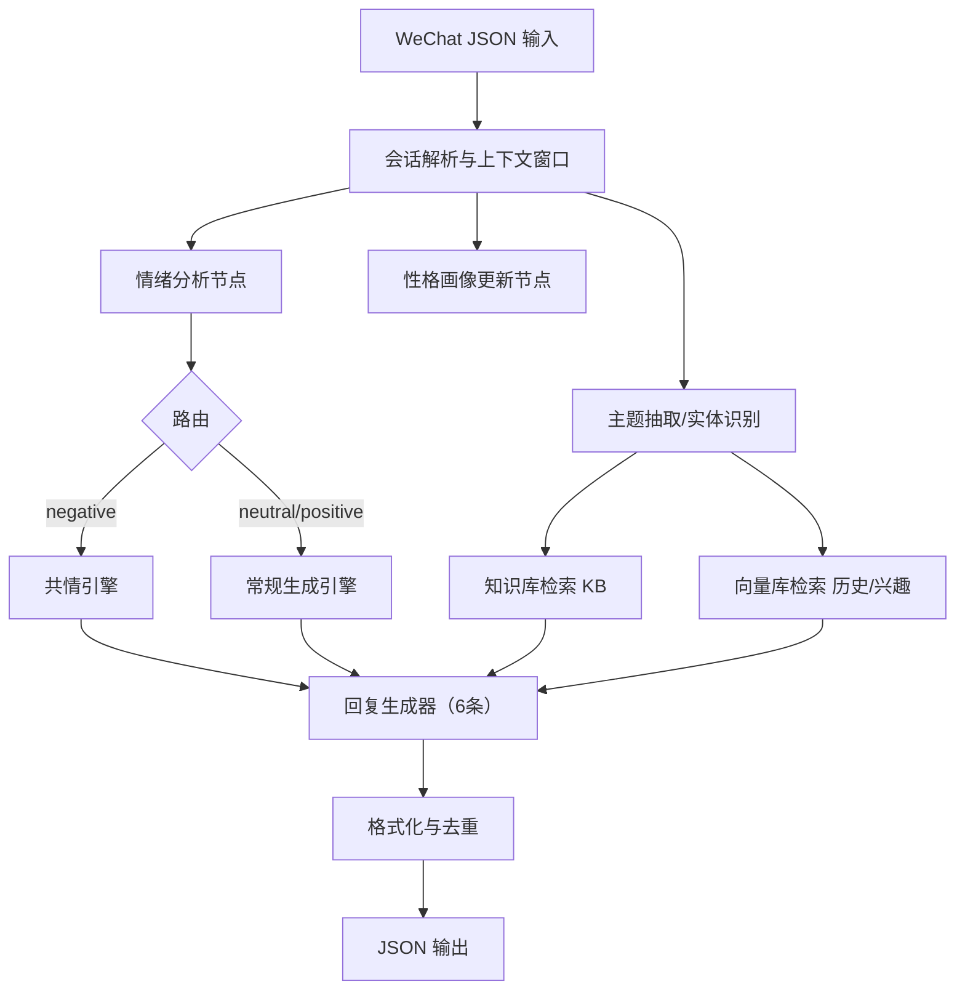
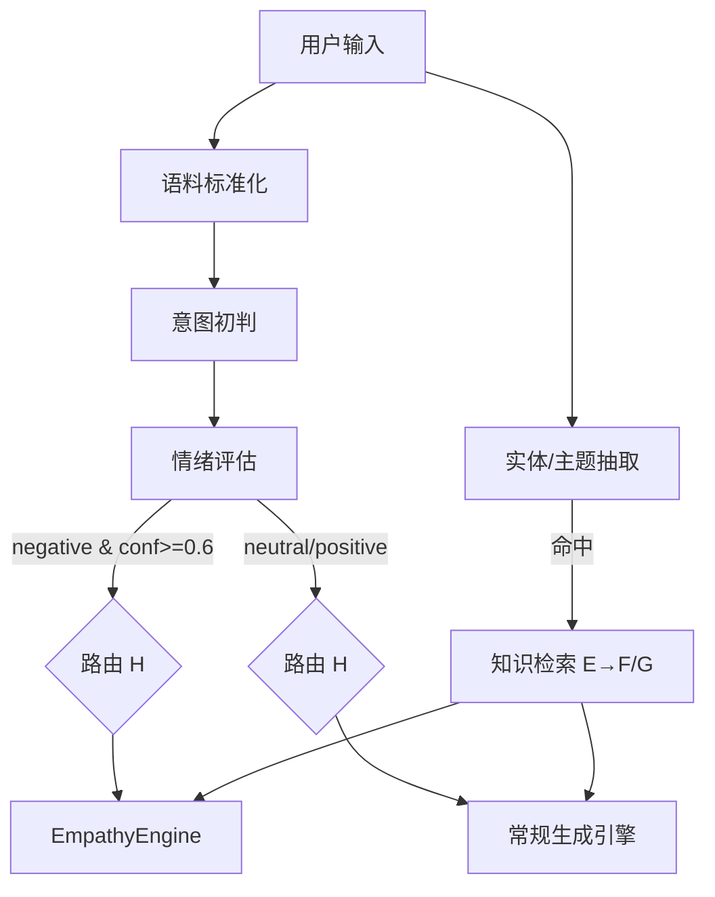
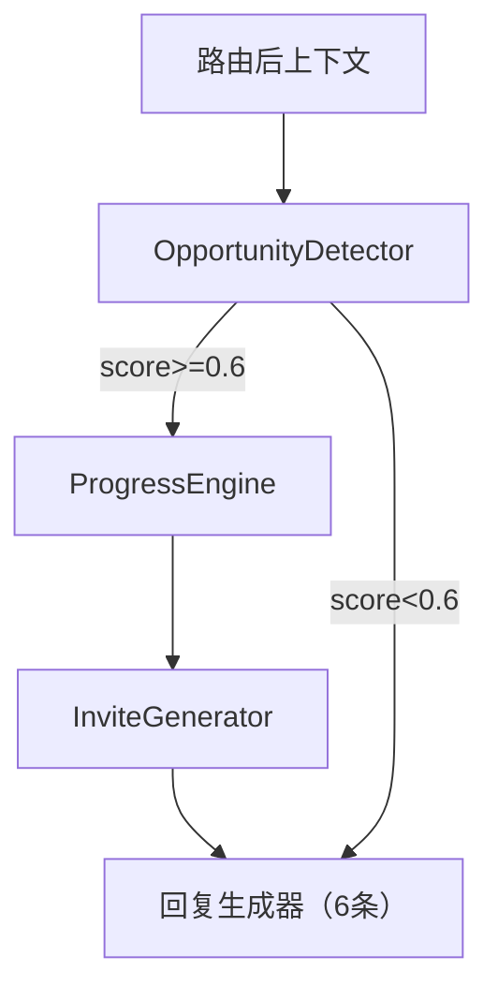

# 恋爱回复 AI Agent 设计文档（基于 LangChain Graph 与千问 API）

## 1. 概述
- 目标：构建面向微信聊天场景的恋爱回复 AI Agent，提供 6 条候选回复及推荐理由，具备共情能力、个性化建模与知识图谱支持。
- 技术栈：LangChain/LangGraph 编排、向量检索与轻量知识库、千问（Qwen）API 兼容模式。
- 输入输出：
  - 输入：微信聊天记录（JSON）
  - 输出：结构化 JSON，包含候选回复与分析结果

## 2. 架构设计

### 2.1 组件与数据流


### 2.2 编排与存储
- 编排：使用 LangGraph（与 LangChain 生态兼容）实现状态图/有向图；节点包括情绪分析、画像更新、知识检索、路由、生成。
- 存储：
  - 轻量知识库（KB）：JSON/YAML 结构化领域知识（人物、作品、事件、话题、平台模型）
  - 向量库：历史对话段落、兴趣标签、情境片段

## 3. 数据与模型

### 3.1 输入 JSON 结构
```json
{
  "session_id": "abc123",
  "messages": [
    { "speaker": "user", "timestamp": 1730000000, "type": "text", "content": "今天心情有点糟" },
    { "speaker": "partner", "timestamp": 1730000100, "type": "text", "content": "怎么啦？" }
  ],
  "user_profile": {
    "nickname": "小林",
    "preferences": ["电影", "音乐"],
    "taboos": ["职场争论"]
  }
}
```

### 3.2 用户画像（示例字段）
- 基础：昵称、性别、年龄段、偏好主题、禁忌话题
- 行为：回复时延、常用语气、表情偏好
- 情绪：近 7 天情绪均值、触发词统计
- 线程画像：当前会话（按 `user_id + target_id`）的临时风格指标（礼貌度、亲密度、幽默度）

### 3.3 知识库与主题映射（KB）
- 实体类型：`Person`、`Work`（影视/书籍/音乐）、`Event`、`Topic`、`Model`
- 关系映射：`ACTED_IN`、`WROTE`、`RELATED_TO`、`POPULAR_IN`、`SUITABLE_FOR`、`COSTS`（以键值或列表存储）
- 关键属性：
  - 作品/人物：名称、别名、标签、时间、热度、领域
  - 模型：上下文长度、适用场景、成本（每千 Token，分输入/输出）、是否支持思考/上下文缓存

### 3.4 模型选择与能力
- `qwen-plus`：
  - 能力均衡，适合中等复杂任务，思考模式可选
  - 支持较长上下文（系列中上限可到约 995,904 tokens；默认输入上限可通过 `max_input_tokens` 调整）
  - 阶梯计价，适合常规对话生成与分析
- `qwen3-max`：
  - 适合复杂、多步骤推理任务，稳定版/快照版可选以锁定能力
  - 上下文长度稳定版可达约 262,144 tokens，预览版支持思考模式
  - 阶梯计价（示例区间：0–32K、32K–128K、128K–252K 输入/输出分级），支持上下文缓存、批量调用折扣

说明：不同版本与区域的具体价格会以平台公布为准；采用阶梯计费与批量折扣策略，并结合上下文缓存优化成本。

## 4. 业务流程与路由

### 4.1 会话解析
- 抽取最近 N 条消息（默认 12），构造上下文窗口
- 标注发言人、时间序列、消息类型；识别表情符号与高强度标点

### 4.2 情绪分析（EmotionAnalyzer）
- 规则评分：负面词典、反问/讽刺模式、表情加权
- LLM 分类：`qwen-plus` 对当前轮与上下文进行情绪类别与置信度评估，并抽取触发短语
- 输出：`emotion`（positive/neutral/negative）、`confidence`、`triggers`

### 4.3 性格画像更新（PersonaProfiler）
- 将本轮行为特征写入线程画像与长期画像
- 指标归一化，维护礼貌度、亲密度、幽默度等风格权重

### 4.4 背景知识搜索（KnowledgeService）
- 主题抽取/实体识别（电影、音乐、人物名等）
- 知识库查询相关 `Person/Work/Topic/Event`，结合向量库召回历史相关片段
- 平台模型知识用于策略解释（如选择模型与上下文长度的理由）

### 4.5 路由规则
- `negative` → 共情引擎优先：降低建议密度、避免否定句、先情感承接再轻建议
- `neutral` → 话题引导 + 轻共情 + 个性化引用素材
- `positive` → 共享喜悦，深化互动与共同计划

### 4.6 回复生成（ReplyGenerator）
- 多样性策略：多路采样（不同 `seed`/`temperature`）或并行生成
- 风格控制：礼貌度、亲密度、幽默度、建议强度
- 个性化融合：画像与历史片段作为软约束素材
- 推荐理由：情绪匹配度、兴趣命中、知识关联度

### 4.7 入口判定与节点选择（Edge & Node）
- 判定步骤（顺序执行）：
  1) 语料标准化：清洗文本、合并连续短句、识别表情/标点强度
  2) 意图初判：分类为“求安慰/闲聊/咨询/计划/提问/吐槽”等
  3) 情绪评估：`EmotionAnalyzer` 输出 `emotion` 与 `confidence`
  4) 实体与主题抽取：检测是否包含电影/音乐/人物/作品等可检索主题
  5) 画像约束加载：读取线程画像与长期画像的风格权重
- 边与节点选择规则：
  - 若 `emotion == negative` 且 `confidence >= 0.6` → 进入路由 H → 边 `H→I` → 节点 `EmpathyEngine`
  - 若 `emotion == neutral/positive` → 进入路由 H → 边 `H→J` → 节点 `常规生成引擎`
  - 若存在可检索实体/主题（电影/音乐/明星/书籍/热点）→ 先走 `E→F/G` 完成知识与向量检索，再进入生成节点（I 或 J）
  - 若为明确问句（含“？/?”、开头为“怎么/为何/哪个/推荐/哪里/多久”等）→ 强制触发 `E→F/G` 检索后再生成
  - 若包含用户禁忌话题（画像 `taboos` 命中）→ 降低建议强度，优先 `EmpathyEngine` 或给出温柔转移话题的生成策略
- 决策示例：
  - “今天心情有点糟” → `negative` → `H→I`
  - “有什么电影推荐吗？”（含电影实体、问句）→ `neutral` + `E→F/G` → `H→J`
  - “你为什么总是这样？”（强负面+反问）→ `negative` → `H→I`
  - “周末一起去看新上映的电影吧”（积极计划+电影主题）→ `positive` + `E→F/G` → `H→J`
- 入口判定流程图：


### 4.8 恋爱推进策略与节点（Progress）
- 目标：在合适时机温柔推进关系，从轻互动到具体邀约，确保边界与尊重。
- 机会信号（示例）：积极回应、互惠问答、共同兴趣、表达空暇时间、暧昧表情、弱拒后再次开启、对你提出开放式问题。
- 新增节点：
  - `OpportunityDetector`：检测推进机会信号与强度评分（0–1）
  - `ProgressEngine`：根据画像与情绪选择推进策略（轻调侃/赞美/开放式问题/小邀约/具体邀约）
  - `InviteGenerator`：在合适时生成具体邀约文案（含时间/地点/备选方案/可撤回选项）
- 边选择规则（与路由 H 联动）：
  - `neutral/positive` 且机会评分≥0.6 → `J→ProgressEngine` → 生成推进型回复；若命中主题则先 `E→F/G` 引入共同兴趣素材。
  - `negative`：先 `I` 共情与安抚；若安抚后置信度提升且机会评分≥0.7，再进行轻微推进（避免直接邀约）。
  - 命中禁忌话题或对方显示退却信号 → 不推进或转为轻松话题引导。
- 亲密度阶梯（示例）：
  1) 轻互动（赞美/共情/趣味点）  
  2) 共同兴趣深化（分享、提问、关联作品）  
  3) 小邀约（低承诺，如“这周找个下午散散步？”）  
  4) 具体邀约（时间地点+备选方案+是否愿意）  
  5) 确认与备选（给对方选择权与退出选项）  
  6) 轻期待（自然表达期待，不施压）
- 文案风格：
  - 轻松、温柔、尊重边界；使用开放式问题与选择权表达；避免强迫和过度私密。
- 推进流程图：


### 4.9 提示词架构（五层融合）
- 基础人格层（核心风格）：关系推进助手，幽默而不失分寸；语境沉浸、情感共振、动态适应。
- 情境感知层（动态决策）：关系阶段（初识/暧昧/稳定/冲突）、情绪基调（1–10）、推进窗口、安全风险点。
- 回复生成层（黄金公式）：核心回应 + 细节延伸 + 情感锚点 + 可选推进钩子（视推进窗口开启）。
- 风格控制层（矩阵适配）：
  - 内向敏感型 → 温柔低刺激，兴趣为锚
  - 外向幽默型 → 调侃快节奏，直接互动邀约
  - 理性务实型 → 逻辑与价值感，目标导向邀约
- 安全边界层（风险控制）：
  - 禁用：查户口式连问、绝对化承诺、油腻情话、未铺垫亲密称呼、否定性评价
  - 紧急刹车：检测“？？/！！”与负面词（尴尬/无语），立即切纯共情+自嘲缓和
  - 亲密递进：基于互动频率与积极反馈逐步提升，设阈值解锁表达方式

## 5. 核心模块说明

### 5.1 EmotionAnalyzer
- 输入：上下文窗口、当前消息
- 输出：类别、置信度、触发短语
- 方法：规则特征 + LLM 分类，`response_format=json`

### 5.2 EmpathyEngine
- 输入：负面情绪分析、触发短语、用户画像
- 输出：安慰性候选回复
- 方法：安慰性模板与风格参数，避免“你应该”“直接否定”

### 5.3 PersonaProfiler
- 输入：历史对话、线程画像
- 输出：风格约束与权重
- 方法：LLM 归纳 + 指标归一化

### 5.4 KnowledgeService
- 输入：主题关键词/实体
- 输出：图谱实体与关系、候选素材片段
- 方法：知识库查询 + 向量召回 + 别名规则映射

### 5.5 ReplyGenerator
- 输入：情绪、画像、图谱素材、上下文窗口
- 输出：6 条多样化回复与理由
- 方法：并行或批量采样、格式化与去重、理由打分

### 5.6 StateManager（状态管理）
- 维护 `ConversationState`：`messages`、`context_summary`、`current_emotion`、`reply_strategy`、`relationship_stage`、`intimacy_level`、`last_interaction`
- 根据路由与推进结果更新 `relationship_stage` 与 `intimacy_level`，为 `ProgressEngine` 提供约束

### 5.7 UserManager（多用户与对象画像）
- 管理 Agent 使用者档案与恋爱对象档案：`TargetProfile`（性格特征、沟通风格、关系阶段、亲密度、互动历史、有效钩子、谨慎话题、共同记忆）
- 支持多用户多对象并发会话，向 `PersonaProfiler` 与 `ReplyGenerator` 提供画像上下文
- 多对象支持：一个用户可管理多个聊天对象（默认不设上限）；可通过配置 `MAX_TARGETS_PER_USER` 进行资源控制（建议默认 20）
- 会话键设计：`session_id = "{user_id}:{target_id}"`；线程画像与推进逻辑均按 `(user_id, target_id)` 作用域维护
- 并发与限流：对 `(user_id, target_id)` 维度进行独立限流与缓存，保证不同对象的会话互不干扰

### 5.8 ModelSelector
- 默认：`qwen-plus`（均衡、较长上下文、思考可选）
- 难例：升级至 `qwen3-max`（复杂、多步推理）
- 降级：限流/成本高峰时使用轻量模型或压缩模板
- 依据：输入 Token 阶梯、上下文长度、节点复杂度、并发负载

### 5.9 ErrorHandler & Retry
- 指数退避重试（如 0.2s、0.5s、1s、2s）
- Fallback：从高阶模型降级或简化提示词
- 记录：错误类型、模型、上下文 Token、节点位置

## 6. API 集成与安全

### 6.1 基本配置
- 基础 URL：`https://dashscope.aliyuncs.com/compatible-mode/v1`
- 鉴权：`Authorization: Bearer ${DASHSCOPE_API_KEY}`，密钥仅经环境变量加载

### 6.2 Python 客户端示例
```python
import os
from openai import OpenAI

client = OpenAI(
    api_key=os.getenv("DASHSCOPE_API_KEY"),
    base_url="https://dashscope.aliyuncs.com/compatible-mode/v1"
)

resp = client.chat.completions.create(
    model="qwen-plus",
    messages=[
        {"role": "system", "content": "你是一个具备共情的恋爱回复助手。"},
        {"role": "user", "content": "今天心情有点糟"}
    ],
    response_format={"type": "json_object"},
    temperature=0.7
)
```

### 6.3 知识库示例（JSON）
```json
{
  "persons": [
    { "name": "某明星", "aka": ["某艺人"], "tags": ["影视"], "popular_in": ["电影"] }
  ],
  "works": [
    { "title": "某电影", "year": 2024, "actors": ["某明星"], "topics": ["爱情", "成长"] }
  ],
  "topics": ["电影", "音乐", "展览"],
  "models": [
    { "name": "qwen-plus", "context_limit": 995904, "cost_policy": "staircase" }
  ]
}
```

### 6.4 安全与隐私
- 不存储明文聊天与密钥；敏感信息脱敏
- 画像数据最小化与可清除
- 日志记录哈希与统计信息，不含完整消息

## 7. 生成策略与输出

### 7.1 多样性生成
- 采用不同 `seed` 与 `temperature` 组合
- 必要时并行生成以控制延迟
- 去重与相似度阈值控制，避免重复表达

### 7.2 推荐理由
- 情绪匹配度（如 85%）
- 兴趣命中度（画像偏好）
- 知识关联度（图谱素材引用）
- 推进机会命中（机会评分与边界安全度）
- 亲密度梯度匹配（当前步与历史画像的一致性）

### 7.3 输出格式
```json
{
  "replies": [
    { "text": "回复内容1", "reason": "推荐理由（情绪匹配度85%）" },
    { "text": "回复内容2", "reason": "推荐理由（情绪匹配度82%）" },
    { "text": "回复内容3", "reason": "推荐理由（话题匹配度80%）" },
    { "text": "回复内容4", "reason": "推荐理由（兴趣命中）" },
    { "text": "回复内容5", "reason": "推荐理由（知识引用）" },
    { "text": "回复内容6", "reason": "推荐理由（语气更柔和）" }
  ],
  "analysis": {
    "emotion": "negative",
    "topics": ["电影", "音乐"],
    "persona_highlights": ["礼貌度高", "偏好温柔语气"],
    "graph_entities": ["某明星", "某电影"]
  }
}
```

## 8. 测试方案

### 8.1 单元测试
- 情绪分类：正/中/负与边界样例
- 画像更新：权重归一化与合并逻辑
- 图谱检索：别名匹配与关系完整性
- 生成格式：6 条候选与理由结构
- 推进检测：机会信号识别与评分阈值
- 邀约文案：含时间/地点/备选与可撤回表达
- 安全边界：禁用词与紧急刹车机制覆盖

### 8.2 集成测试
- 端到端：JSON → Graph → 6 候选 → JSON 输出
- 路由分支：负面走共情，正/中性走常规
- 推进分支：正/中性且机会评分高时触发推进路径；负面场景验证“先安抚、再轻推进/不推进”
- 多对象并发：同一用户不同对象的会话隔离与限流验证；线程画像不串扰

### 8.3 压力测试
- 并发会话模拟与令牌桶限流
- 模型降级与重试效果验证
- 监测 P95 延迟与失败率

### 8.4 验收指标
- 情绪匹配度 ≥ 80%
- 用户满意度问卷 ≥ 4/5
- P95 延迟 ≤ 2.5s（常规长度与默认模型）

## 9. 部署与运维

### 9.1 环境变量
- `DASHSCOPE_API_KEY`
- `OPENAI_BASE_URL=https://dashscope.aliyuncs.com/compatible-mode/v1`
- `NEO4J_URI`、`NEO4J_USERNAME`、`NEO4J_PASSWORD`

### 9.2 运行模式
- 开发：本地轻量知识库（JSON/YAML） + 文件向量库
- 生产：托管向量库/云存储知识库，模型版本快照化

### 9.3 限流与缓存
- 模型级配额与令牌桶
- 上下文缓存与热点主题缓存（TTL）
- 观测：耗时、错误率、生成质量

## 10. 迭代方向
- 个性化打分器：基于反馈动态调整生成权重
- 主动引导：温柔开放式问题策略
- 多模态：图片与表情的语义融合
- 版本策略：稳定版/快照版结合以平衡能力与一致性

---

如需调整：例如将默认模型提升为 `qwen3-max`（思考模式），或修改节点命名/路由细则、画像字段与打分口径、定价策略说明等，请直接在此文档标注你希望的改动点；我会据此更新后进入开发实现。
